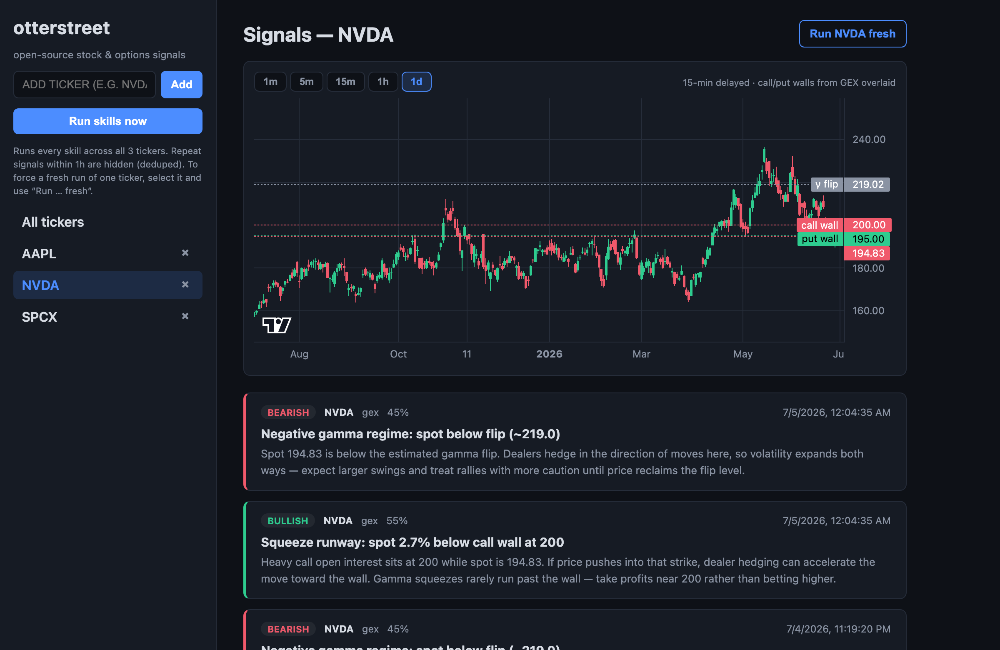

# otterstreet

Open-source stock & options signal engine. Add tickers to a watchlist; pluggable
**skills** poll market data, filings, and news sources on a schedule and generate
bullish/bearish signals with plain-language rationale. LLM-assisted skills (news,
social sentiment) use your own OpenAI API key. Not high-frequency by design —
minute-cadence polling, human-in-the-loop trading.



> **Not financial advice.** Signals are heuristics over public data. Do your own research.

## Quickstart (zero API keys)

```bash
pnpm install
pnpm dev
```

- Server: http://127.0.0.1:8420 (Fastify + SQLite)
- Web UI: http://127.0.0.1:5173 (Vite + React, proxies `/api` to the server)

With no `POLYGON_API_KEY` set, the server falls back to the **mock provider**
(deterministic synthetic quotes and options chains), so you can add a ticker,
click **Run skills now**, and see GEX signals immediately.

### Real market data (Polygon) — required plans

Polygon.io is the default provider. **Minimum requirement: Polygon
[Stocks Starter](https://polygon.io/pricing) + [Options Starter](https://polygon.io/pricing)
(~$29/mo each).** Both are needed and each covers a distinct part of the app:

| Plan | Provides | Used by |
|---|---|---|
| **Options Starter** | Options chain snapshot — open interest, greeks, IV | GEX / call wall / put wall / gamma flip (and future options skills) |
| **Stocks Starter** | Underlying quote + intraday OHLCV bars | Candlestick charts, underlying spot, future technical skills (RSI, Bollinger…) |

Both are 15-min delayed with **unlimited API calls** — fine for this tool, which
is minute-cadence by design (OCC publishes open interest once daily anyway). The
free "Basic" tier is **not supported**: it returns `403 NOT_AUTHORIZED` for the
options chain snapshot the GEX skill depends on. You do **not** need the Trades
(tick-data) product — the skills use snapshots and pre-aggregated bars.

1. Subscribe to both Starter plans on the [Polygon dashboard](https://polygon.io/dashboard/keys).
2. `cp .env.example .env`, set `POLYGON_API_KEY=...` (leave `PROVIDER=polygon`).
3. Restart the server.

Tradier is supported as an alternative (`PROVIDER=tradier`, `TRADIER_TOKEN=...`).
Providers are selected per capability (`QUOTES_PROVIDER`, `BARS_PROVIDER`,
`OPTIONS_PROVIDER` override `PROVIDER`), so plans can be mixed as more providers
are added.

> The **mock provider** (used automatically when `POLYGON_API_KEY` is unset)
> serves deterministic synthetic data with no keys — for local development only,
> not real signals.

## Architecture

```
apps/
  server/          Fastify API + cron scheduler + SQLite (watchlist, signals)
  web/             React UI (watchlist, signal feed)
packages/
  core/            Types: providers (capabilities), SignalSkill, Signal
  providers/       Market data providers: Polygon, Tradier, Mock
  skills/
    gex/           Gamma exposure: call wall, put wall, gamma flip, squeeze setups
```

**Providers** implement *capabilities* (`quotes`, `options_chain`, `bars`, later
`news`, `filings`, `llm`, `scrape`). **Skills** declare which capabilities they
need plus a cron schedule; the scheduler runs each skill against every watchlist
ticker and dedupes repeated headlines. One options-chain subscription feeds many
skills (GEX, call wall, max pain, put/call) without duplicate fetching.

### Writing a skill

```ts
import type { SignalSkill } from "@otterstreet/core";

export const mySkill: SignalSkill = {
  id: "my-skill",
  name: "My Skill",
  description: "…",
  schedule: "*/15 * * * *",
  requires: ["quotes"],
  async run(ctx, ticker) {
    const quote = await ctx.providers.quotes!.getQuote(ticker);
    return [/* Signal[] */];
  },
};
```

Register it in `apps/server/src/index.ts` (`skills` array). Skills that scrape
websites without an official API must require the `"scrape"` capability so
hosted deployments can disable them (`ENABLE_SCRAPE_SKILLS=false`).

## Skill roadmap

| Skill | Data source | Status |
|---|---|---|
| GEX / call wall / gamma flip | Options chain (Polygon/Tradier) | ✅ shipped |
| Max pain, put/call ratio | Options chain, CBOE | planned |
| Technicals (RSI, Bollinger, prior high, volume trend) | OHLCV bars | planned |
| Month-end pension rebalancing | Calendar rule + index bars | planned |
| Insider sale notices (Form 144 / Form 4) | SEC EDGAR (free) | planned |
| 13F institutional holdings diff | SEC EDGAR / 13f.info | planned |
| IPO lockup expirations | EDGAR S-1/424B4, calendars | planned |
| Analyst upgrades/downgrades | FMP / Benzinga | planned |
| Earnings & peer-earnings calendar | FMP / Finnhub | planned |
| Reddit sentiment | Reddit API + LLM | planned |
| Layoff news | WARN notices, layoffs.fyi, news APIs + LLM | planned |
| YouTube channel monitor | YouTube Data API + LLM | planned |
| Risk-off regime (yields, DXY, gold, VIX) | FRED (free) | planned |
| Order flow (large prints/sweeps) | Polygon trades, Databento | planned |

## License

[AGPL-3.0](LICENSE). The core is and will remain open source for local
deployment; a hosted version with premium skills may be offered separately.
